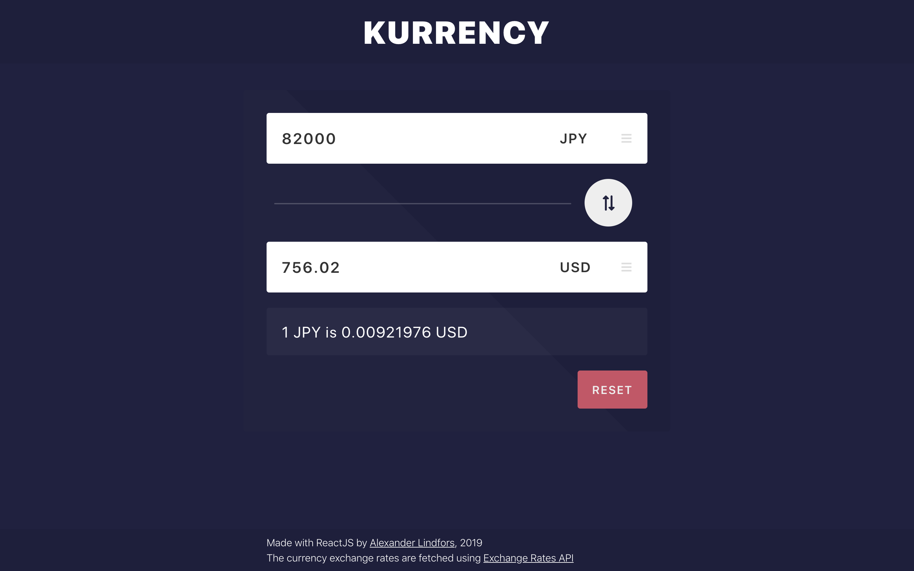
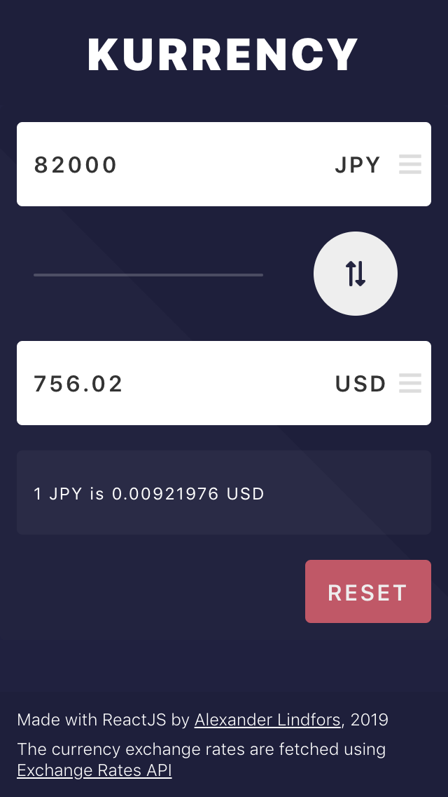

# Kurrency
A currency converter front end made with React.

See it in action <a href="https://alindfor.github.io/Kurrency/" target="_blank" rel="noopener noreferrer">here</a>.

## Features
* Fetches currency reates from [Exchange rates API](https://exchangeratesapi.io/).
  * Only fetches on page load
  * No handling of API unavailability
* Responsive layout
* Select currency from list of available currencies
  * Currently can only use currencies and reates provided by API
* Swap currently used currencies
* Reset all fields

# Layout overview
## Large screen

## Small screen

